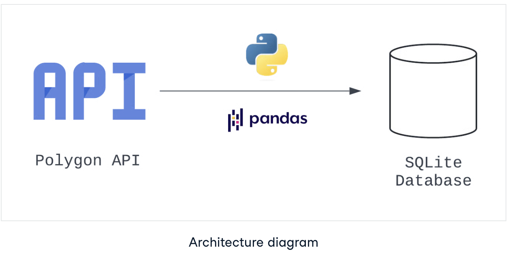

# ETL Pipeline with Apache Airflow

This project guides you through building an ETL (Extract‑Transform‑Load) pipeline using Apache Airflow. You extract stock market data from the Polygon API, transform it into a tabular format, and load it into a SQLite database. Apache Airflow orchestrates the workflow, making it reliable and easy to manage.

---

## Live or Screenshot Preview

*(Add a screenshot here to visually showcase your Airflow DAG or pipeline results.)*

```

```

---

## Project Overview

**Objective:**

* Build a reliable ETL pipeline that pulls stock market data, transforms it, and persists it in a SQLite database
* Use Apache Airflow to automate, schedule, and monitor the pipeline

**Data Source:**

* Polygon API (stock market data via free-tier API)

**Destination:**

* SQLite database for simple and easy data analysis

---

## Tech Stack

| Component              | Tools & Technologies                           |
| ---------------------- | ---------------------------------------------- |
| Workflow Orchestration | Apache Airflow (with Astro CLI & TaskFlow API) |
| Data Extraction        | Python (`requests` module)                     |
| Data Transformation    | Pandas (JSON flattening, cleaning)             |
| Data Storage           | SQLite database                                |
| Development Tools      | Astro CLI, Docker (for Airflow environment)    |

---

## Pipeline Design & Structure

### Architecture Outline

1. **Extract**

   * Task: `hit_polygon_api`
   * Fetch stock data via Polygon API using the TaskFlow API in Airflow

2. **Transform**

   * Task: `flatten_market_data`
   * Parse JSON, fill missing fields with defaults, convert to pandas DataFrame

3. **Load**

   * Task: `load_market_data`
   * Load cleaned data into a SQLite database table

### DAG Configuration Highlights

| Parameter         | Value                                     |
| ----------------- | ----------------------------------------- |
| DAG ID            | `market_etl`                              |
| Start Date        | January 1, 2024 at 09:00 AM UTC           |
| Schedule Interval | Daily (`@daily`)                          |
| Catchup           | `True` (backfills from start date)        |
| Concurrency       | Max active runs = 1                       |
| Retries           | 3 retries per task                        |
| Retry Delay       | 5 minutes between retries                 |
| Dynamic Tickers   | Supports dynamic DAGs for multiple stocks |

---

## Methodology

1. **Setup Environment**

   * Installed Astro CLI and initialized Airflow project
   * Defined project structure (`dags/`, `plugins/`, etc.) and launched Airflow via Docker

2. **Define DAG & Tasks**

   * Configured DAG parameters based on the specification
   * Built `extract`, `transform`, `load` tasks using TaskFlow API
     ([DataCamp][1], [DataCamp][2])

3. **Extract Phase**

   * Created Python function to call Polygon API and return results
   * Integrated as `hit_polygon_api` Airflow task
     ([DataCamp][1])

4. **Transform Phase**

   * Flattened the JSON response into a structured table using pandas
   * Handled missing fields with sensible defaults

5. **Load Phase**

   * Persisted the resulting DataFrame to a SQLite database

6. **Orchestration & Monitoring**

   * Used Airflow UI to track task status, retries, and logs
   * DAG runs are scheduled daily, with retries and catchup enabled

---

## Key Learnings & Highlights

* Built a modular ETL pipeline in Python using Airflow’s DAG architecture
* Applied data extraction from an API, structured transformation, and SQLite loading
* Configured pipeline scheduling, retries, and catch-up behavior for resilience
* Learned best practices for pipeline orchestration with TaskFlow API

---

## Possible Extensions

* **Add More Destinations:** Push data to cloud data warehouses like BigQuery or Snowflake
* **Data Validation:** Introduce quality checks using tools like Great Expectations
* **Scalability:** Migrate from SQLite to PostgreSQL or other robust databases
* **Dynamic Pipelines:** Auto-generate DAGs for multiple stock tickers using loops or templates
* **Visualization and Reporting:** Link pipeline results to BI tools (Tableau, Looker Studio)

---

